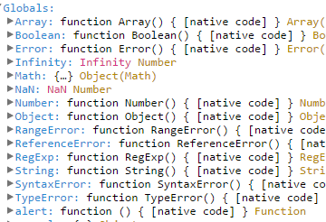
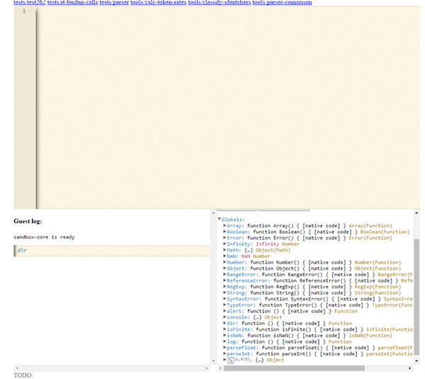

# Javascript Sandbox #

Sandbox for safe execution of untrusted javascript code on the same page with the trusted code.
It is implemented as a virtual machine comprised of lexer, parser and runtime written in
[TypeScript](https://www.typescriptlang.org/).
It is able to run javascript conforming to *ECMA-262 5.1 Edition*.

### Guest environment ###
Guest code doesn't have access to the browser environment.
Environment is initially configured the way that all the guest code can operate on,
is a very limited set of functions and objects defined by the *ECMA-262 5.1* standard.

### Runtime usage example ###
1. Download the code.
2. Open `JavascriptSandbox.sln` with the [Microsoft Visual Studio](https://www.visualstudio.com/)
and run it by hitting `F5`.
3. Your internet browser should open the `default.htm` page.

In the top middle part of the page you'll see the code editor window.
You can enter javascript code there and it will be immediately loaded into the sandbox and executed.
Bottom right corner holds hierarchical view of all the variables that are accessible to the guest code.
Bottom left corner contains output produced after executing the guest code.
It also contains the console line,
which can be used to send javascript code to the `VM` and receive output immediately.

### Unit tests ###
This project relies heavily on such quality assurance method as *unit testing*.
Test suite is borrowed from the *ECMA*.
It is the same tests that are used to verify validity of the major javascript engines.

#### Running unit tests ####
1. Open `JavascriptSandbox.sln` with the [Microsoft Visual Studio](https://www.visualstudio.com/)
and run it by hitting `F5`.
2. Your internet browser should open the `default.htm` page.
3. In the top left corner of the default page should be a link titled *"tests/test262"*.
Click it.
4. You'll see the *"ECMAScript Language test262"* page,
the main page of the test suite.
The test suite is modified the way that it executes test code **not** in the browser you're using,
but in the **sandbox** that runs inside your browser.
5. Click `Run` to get to the page where you can actually run the tests.
